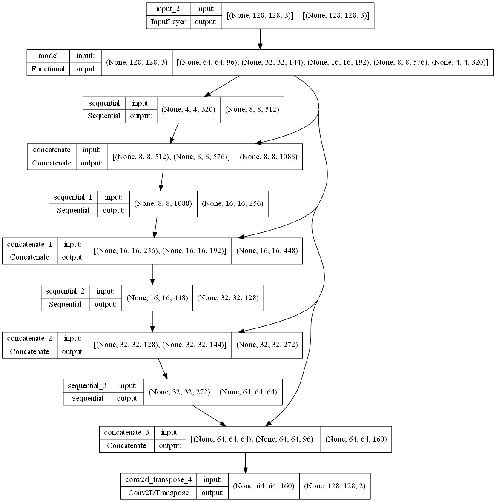
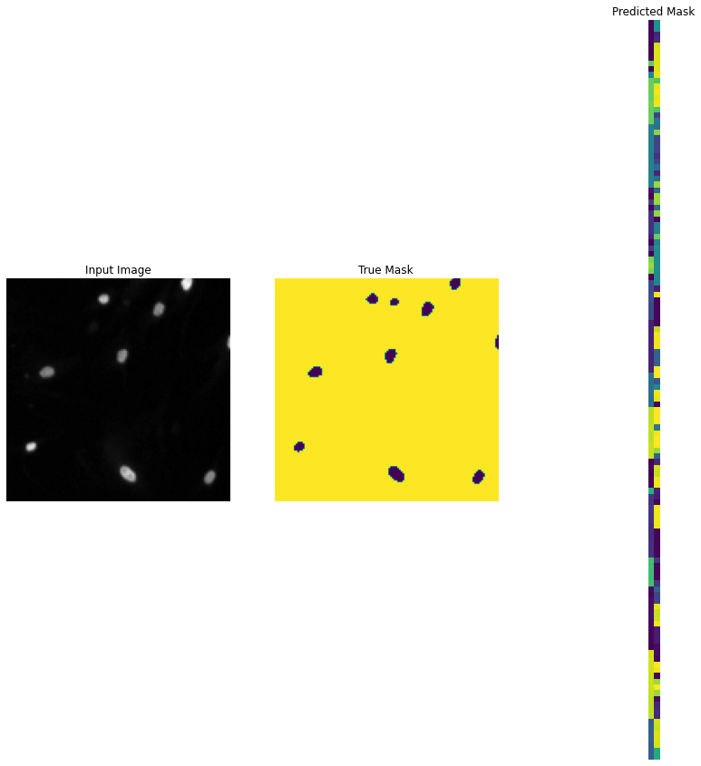
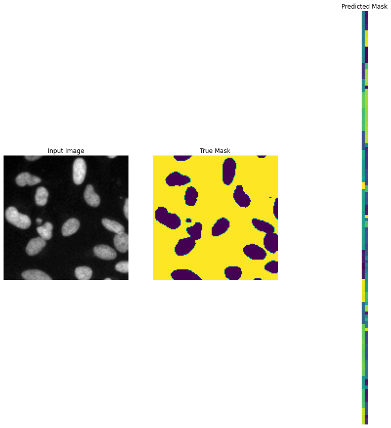

# Cell Nuclei Detection using Semantic Segmantation with U-Net

## 1. Summary 
The aim of this project is to detect cell nuclei using image segmentation process on biomedical images. The images of of the nuclei are acquired varying in cell type, magnification and imaging modality. Deep learning model is trained and deployed for this task. The dataset is acquired from https://www.kaggle.com/competitions/data-science-bowl-2018/data
## 2. IDE and Framework
Spyder is used as the main IDE for this project. The main framework used for this project are TensorFlow, Numpy, Matplotlib, OpenCV and scikit-learn
## 3. Methodology 
The methodology for this project is inspired from official TensorFlow website which can be refer here: https://www.tensorflow.org/resources/models-datasets
### 3.1 Input Pipeline
The dataset folder contain train and test folder separately. Each folder are further divided into images and masks folder. Images folder contains the raw images which will be used as an input and masks folder contain the mask of image which are used for output or label data. The input images are preprocessed using feature scaling and the labels are preprocess such the values of binary of 0 and 1. No data augmentation algorithm is applied to the input. The data are split into 80:20 training test ratio.
### 3.2 Model Pipeline
The model architecture used for this project is U-Net. For further details on the models architecture can be refer on the TensorFlow website. In general, the model consist of a downward stack which serves as a feature extractor. The upward stack produces the pixel-wise output. The model structure is shown in the figure below. 

The model is trained with batches size 16 and 20 epochs. The training stops at epochs 20 with accuracy of 97% and loss 0.0625.
## 4. Results
The model is evaluated with test data which is shown in figure below.
Some predictions are also made wiht the model using some of the test data. The actual output masks and predicted masks are shown in the figures below.

Overall the model are able to segmenting the nuclei with excelent accuracy. 
